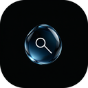

# liquid-newtab

  <a href="#中文">🇨🇳 中文</a> &nbsp;|&nbsp;
  <a href="#english">🇬🇧 English</a>

  

  
  
  
  
  
  
  

---

# 中文

极简的液态玻璃新标签页 —— 一个浏览器新标签页扩展，打开即是液态玻璃质感 + 必应每日壁纸。

## 功能

- 液态玻璃搜索框：从顶部黑边往下拖拽，液滴渗出、弹簧形变成搜索胶囊
- 必应每日壁纸背景，液态玻璃直接折射壁纸
- 可自定义背景：必应每日壁纸 / 自定义上传图片 / 纯色程序化
- 可自定义搜索引擎：必应 / 百度 / 谷歌 / DuckDuckGo / 自定义模板（`%s` 占位）
- 右侧滑出式毛玻璃设置面板，板块可折叠

## 安装

- 下载最新发行版(.crx/.zip)即可安装

### 安装遇到问题？
按照以下顺序依次进行
1. 在浏览器地址栏输入`chrome://flags/#extension-mime-request-handling`回车后将黄色荧光标记的选项调整为`Always prompt for install`后重新下载
2. 在浏览器地址栏输入`chrome://extensions/`打开开发者模式，将解压后的zip导入

## 使用

- 从屏幕最上边往下拖，液态玻璃搜索胶囊从边缘渗出
- 输入回车搜索（输入像网址则直接打开）
- 鼠标移到屏幕右侧唤出设置面板，点板块标题展开 / 收起

## 技术栈

- Manifest V3
- WebGL2 / GLSL 着色器（QuartzCore SDF 管线风格液态玻璃效果）
- 原生 HTML / CSS / JS，零第三方依赖

## 上游

视觉效果移植自 [aaaa-zhen/siri-glsl](https://github.com/aaaa-zhen/siri-glsl)（MIT）。

## License

[MIT](LICENSE)

---

# English

A minimal liquid-glass new-tab extension for browsers. Open a new tab to get a liquid-glass search capsule over Bing's daily wallpaper.

## Features

- Liquid-glass search capsule: drag down from the top edge to let the droplet seep out and spring into a search pill
- Bing daily wallpaper as background, refracted directly through the glass
- Customizable background: Bing daily / uploaded image / procedural solid
- Customizable search engine: Bing / Baidu / Google / DuckDuckGo / custom template (`%s` placeholder)
- Frosted-glass settings panel slides in from the right, with collapsible sections

## Installation

- Download the latest release (`.crx` / `.zip`) and install it

### Installation issues?
Follow these steps in order
1. In the address bar enter `chrome://flags/#extension-mime-request-handling`, press Enter, set the yellow-highlighted option to `Always prompt for install`, then re-download
2. In the address bar enter `chrome://extensions/`, enable Developer mode, and import the extracted zip

## Usage

- Drag down from the top of the screen to seep out the search capsule
- Type and press Enter to search (directly opens if it looks like a URL)
- Move the mouse to the right edge to open settings; click a section title to expand / collapse

## Tech Stack

- Manifest V3
- WebGL2 / GLSL shaders (QuartzCore SDF-style liquid glass)
- Vanilla HTML / CSS / JS, zero third-party dependencies

## Upstream

Visual effect ported from [aaaa-zhen/siri-glsl](https://github.com/aaaa-zhen/siri-glsl) (MIT).

## License

[MIT](LICENSE)
